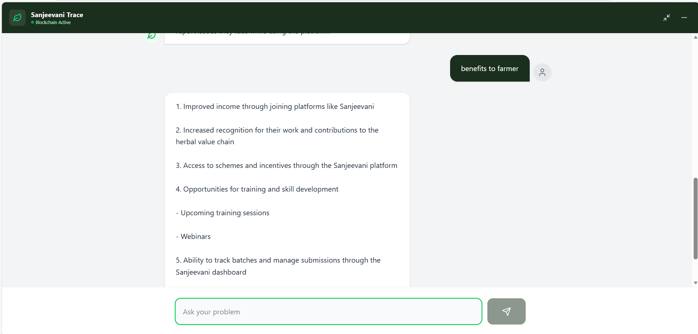
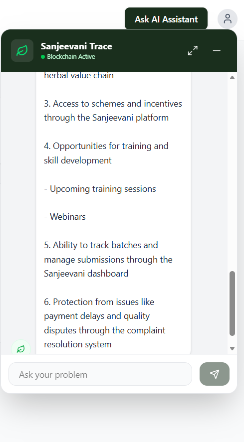

Sanjeevani is a full-stack RAG (Retrieval-Augmented Generation) chatbot platform designed to support farmers and stakeholders in the Ayurvedic ecosystem.
It provides transparent information, guidance, and traceability using modern AI, blockchain concepts, and a user-friendly chat interface.

🚀 Features

🤖 AI-powered RAG Chatbot

Uses document-based retrieval for accurate answers

Avoids hallucinations by grounding responses in data

🧾 Bullet-point, structured responses

Clear, readable, and user-friendly answers

Supports numbered points and sub-points

🧠 Session-based conversation memory

Maintains context using session IDs

Handles greetings and follow-up questions cleanly

🌱 Farmer-centric design

Information about schemes, incentives, complaints, traceability

Inclusive for women farmers and small-scale cultivators

⛓️ Blockchain-inspired traceability concept

Batch verification, quality assurance, and transparency

💬 Modern chat UI

Typing animation

Expand / collapse chat window

Hindi + English welcome support

🛠️ Tech Stack
Frontend

React (Vite)

Tailwind CSS

Lucide Icons

Fetch API

Backend

FastAPI

Python

RAG pipeline (LLM + Vector Retrieval)

integration

📂 Project Structure
Sanjeevani_chatbot/
│
├── chatbot_frontend/
│   ├── src/
│   │   ├── components/
│   │   │   └── ChatWidget.jsx
│   │   ├── api/
│   │   │   └── chat.js
│   │   └── App.jsx
│   ├── .env.example
│   └── package.json
│
├── chatbot_backend/
│   ├── backend/
│   │   ├── rag/
│   │   └── main.py
│   ├── .env.example
│   └── requirements.txt
│
├── .gitignore
└── README.md

⚙️ Environment Setup
🔐 Backend .env (not committed)

Create chatbot_backend/.env:

OPENAI_API_KEY=your_api_key_here

🌐 Frontend .env (not committed)

Create chatbot_frontend/.env:

VITE_API_URL=http://localhost:8000

▶️ Running the Project Locally
1️⃣ Backend (FastAPI)
cd chatbot_backend
python -m venv .venv
.venv\Scripts\activate
pip install -r requirements.txt
uvicorn main:app --reload

Backend runs at:

http://localhost:8000

2️⃣ Frontend (React)
cd chatbot_frontend
npm install
npm run dev

Frontend runs at:

http://localhost:5173

---

## 📸 Project Screenshots

### 💬 Chat Interface

Session-based memory

CORS enabled for frontend integration
